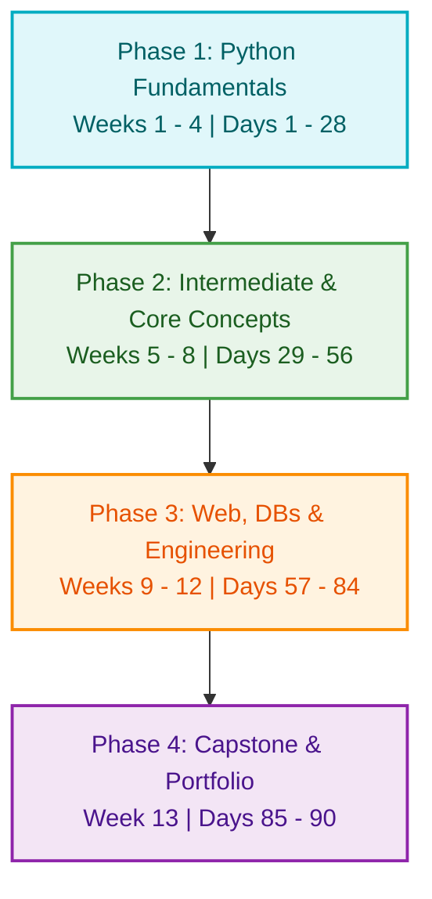

# ⚡ 90 Days to Python: Master Python from Zero to Production

[](https://www.python.org/)
[](https://github.com/)
[](https://github.com/)
[](https://opensource.org/licenses/MIT)

Welcome to **90 Days to Python**! 🚀 This repository is a meticulously designed, highly structured, and comprehensive self-study curriculum for anyone looking to master Python from the ground up and build a stellar developer portfolio. 

Whether you're an absolute beginner typing your first line of code or a developer transitioning from another language, this path will guide you through 90 daily bite-sized steps covering core fundamentals, advanced techniques, modern engineering practices, databases, APIs, web scraping, data science, and test-driven development.

---

## 🎨 Why This Curriculum?

1. **Structured Learning**: Say goodbye to "tutorial hell". Learn concepts sequentially, where each day builds on the previous one.
2. **Practice-First**: Every day includes conceptual explanations, live code examples, and structured daily exercises.
3. **Professional Tools**: You will learn modern engineering tools like `git`, virtual environments (`venv`), virtual package managers, database systems, testing suites (`unittest`, `pytest`), and modern web frameworks (`FastAPI`).
4. **Portfolio Ready**: The structure is set up for you to fork the repository, write code in the templates, check off daily milestones, and share your personal progress as a living portfolio!

---

## 🗺️ The 90-Day Learning Path



---

## 📅 Roadmap & Syllabus Dashboard

Expand any week below to explore the daily topics, and click on the **Week Title** to open its dedicated folder containing lessons, examples, and assignments.

### 🔷 Phase 1: Python Fundamentals (Days 1 - 28)

<details>
<summary><b>Week 1: Basics & Environment Setup (Days 1 - 7)</b></summary>

*   **Folder:** [Week 01 - Basics & Setup](file:///./weeks/week_01_basics_and_setup)
*   **Topics:**
    *   `[ ]` **Day 01**: Environment Setup (Python, VS Code, Git/GitHub)
    *   `[ ]` **Day 02**: Variables, Assignment, & Primitive Data Types
    *   `[ ]` **Day 03**: Dynamic Typing, Casting, & Input/Output
    *   `[ ]` **Day 04**: Arithmetic & Comparison Operators
    *   `[ ]` **Day 05**: String Manipulation, Methods & f-strings
    *   `[ ]` **Day 06**: PEP 8 Style Guide, Inline Comments, and Clean Code
    *   `[ ]` **Day 07**: **Milestone Project**: *Interactive Tip & Split Calculator*
</details>

<details>
<summary><b>Week 2: Control Flow & Decision Making (Days 8 - 14)</b></summary>

*   **Folder:** [Week 02 - Control Flow](file:///./weeks/week_02_control_flow_loops)
*   **Topics:**
    *   `[ ]` **Day 08**: Conditional Statements (`if`, `elif`, `else`)
    *   `[ ]` **Day 09**: Logical Operators & Nested Conditionals
    *   `[ ]` **Day 10**: Iteration with `while` Loops & Infinite Loops
    *   `[ ]` **Day 11**: Iteration with `for` Loops & the `range()` function
    *   `[ ]` **Day 12**: Loop Control: `break`, `continue`, and `pass`
    *   `[ ]` **Day 13**: Nested Loops & Ternary Operators
    *   `[ ]` **Day 14**: **Milestone Project**: *Number Guessing / Text-Based Adventure Game*
</details>

<details>
<summary><b>Week 3: Core Data Structures (Days 15 - 21)</b></summary>

*   **Folder:** [Week 03 - Data Structures](file:///./weeks/week_03_data_structures)
*   **Topics:**
    *   `[ ]` **Day 15**: Lists (Indexing, Slicing, and Basic List Methods)
    *   `[ ]` **Day 16**: List Comprehensions (Writing clean, Pythonic code)
    *   `[ ]` **Day 17**: Tuples (Immutability, Packing, & Unpacking)
    *   `[ ]` **Day 18**: Sets (Uniqueness, Union, Intersection, Differences)
    *   `[ ]` **Day 19**: Dictionaries (Key-Value mappings, nesting, & methods)
    *   `[ ]` **Day 20**: Dictionary Comprehensions
    *   `[ ]` **Day 21**: **Milestone Project**: *Interactive Contact Book CLI*
</details>

<details>
<summary><b>Week 4: Functions & Modularity (Days 22 - 28)</b></summary>

*   **Folder:** [Week 04 - Functions & Modules](file:///./weeks/week_04_functions_modules)
*   **Topics:**
    *   `[ ]` **Day 22**: Function Definitions, Parameters, and Return Values
    *   `[ ]` **Day 23**: Keyword Arguments, Default Parameters, `*args`, & `**kwargs`
    *   `[ ]` **Day 24**: Variable Scope: Local, Global, and `global` keyword
    *   `[ ]` **Day 25**: Anonymous Functions (Lambdas) & Higher-Order Functions (`map`, `filter`)
    *   `[ ]` **Day 26**: Standard Library Modules (`math`, `random`, `datetime`, `os`)
    *   `[ ]` **Day 27**: Designing Custom Modules and Packages
    *   `[ ]` **Day 28**: **Milestone Project**: *Word Guessing (Hangman CLI)*
</details>

---

### 🟢 Phase 2: Intermediate & Advanced Python (Days 29 - 56)

<details>
<summary><b>Week 5: Exceptions & File Operations (Days 29 - 35)</b></summary>

*   **Folder:** [Week 05 - File I/O & Exceptions](file:///./weeks/week_05_file_exception_io)
*   **Topics:**
    *   `[ ]` **Day 29**: Exception Handling with `try`, `except`, `else`, `finally`
    *   `[ ]` **Day 30**: Raising exceptions and defining Custom Exceptions
    *   `[ ]` **Day 31**: Basic File I/O (Reading text files safely with `with`)
    *   `[ ]` **Day 32**: Writing and appending data to text files
    *   `[ ]` **Day 33**: Reading & Writing CSV Files (`csv` module)
    *   `[ ]` **Day 34**: Serializing Data with JSON (`json` module)
    *   `[ ]` **Day 35**: **Milestone Project**: *Daily Personal Expense Tracker CLI*
</details>

<details>
<summary><b>Week 6: Object-Oriented Programming - OOP (Days 36 - 42)</b></summary>

*   **Folder:** [Week 06 - OOP](file:///./weeks/week_06_oop)
*   **Topics:**
    *   `[ ]` **Day 36**: Introduction to Classes, Objects, and the `__init__` constructor
    *   `[ ]` **Day 37**: Instance Attributes, Methods, and the `self` keyword
    *   `[ ]` **Day 38**: Class Variables vs Instance Variables, `@classmethod`, `@staticmethod`
    *   `[ ]` **Day 39**: Class Inheritance & Method Overriding
    *   `[ ]` **Day 40**: Encapsulation, Private attributes, and `@property` getters/setters
    *   `[ ]` **Day 41**: Dunder (Magic) Methods (`__str__`, `__repr__`, `__len__`, `__eq__`)
    *   `[ ]` **Day 42**: **Milestone Project**: *Virtual Bank Account Management System*
</details>

<details>
<summary><b>Week 7: Advanced Modules, Regex, & APIs (Days 43 - 49)</b></summary>

*   **Folder:** [Week 07 - Regex, Dates & APIs](file:///./weeks/week_07_regex_apis)
*   **Topics:**
    *   `[ ]` **Day 43**: Pattern Matching with Regular Expressions (`re` module)
    *   `[ ]` **Day 44**: Managing Timestamps and Offsets (`datetime`, `time`, `pytz`)
    *   `[ ]` **Day 45**: Network requests and APIs using the `requests` library
    *   `[ ]` **Day 46**: Parsing REST API Payloads (headers, authorization, query params)
    *   `[ ]` **Day 47**: Modern Python Environments: `venv`, `requirements.txt`, `pip`
    *   `[ ]` **Day 48**: Understanding Closures and Decorator functions
    *   `[ ]` **Day 49**: **Milestone Project**: *Live Weather Forecast CLI App*
</details>

<details>
<summary><b>Week 8: Introduction to Data Science (Days 50 - 56)</b></summary>

*   **Folder:** [Week 08 - Data Science Intro](file:///./weeks/week_08_data_science_numpy)
*   **Topics:**
    *   `[ ]` **Day 50**: Data Science Environments: Installing Anaconda & Jupyter Notebook
    *   `[ ]` **Day 51**: Intro to NumPy: N-dimensional Arrays and Vectorization
    *   `[ ]` **Day 52**: NumPy Math Operations & Indexing / Slicing
    *   `[ ]` **Day 53**: Data Manipulation with Pandas: Series & DataFrames
    *   `[ ]` **Day 54**: Pandas Data Wrangling (filtering, grouping, handling nulls)
    *   `[ ]` **Day 55**: Basic Data Visualization with Matplotlib & Seaborn
    *   `[ ]` **Day 56**: **Milestone Project**: *Exploratory Data Analysis (EDA) on a Real Dataset*
</details>

---

### 🟠 Phase 3: Web, Databases & Engineering (Days 57 - 84)

<details>
<summary><b>Week 9: Databases & SQL Basics (Days 57 - 63)</b></summary>

*   **Folder:** [Week 09 - Databases & SQL](file:///./weeks/week_09_databases_sql)
*   **Topics:**
    *   `[ ]` **Day 57**: Relational Databases concepts and basic SQL commands
    *   `[ ]` **Day 58**: Python SQLite Integration (`sqlite3` module)
    *   `[ ]` **Day 59**: Implementing CRUD Operations programmatically
    *   `[ ]` **Day 60**: Introduction to Object-Relational Mappers (ORMs): SQLAlchemy
    *   `[ ]` **Day 61**: Modeling Relationships and foreign keys
    *   `[ ]` **Day 62**: Connecting and working with PostgreSQL databases
    *   `[ ]` **Day 63**: **Milestone Project**: *School Grade Database Manager*
</details>

<details>
<summary><b>Week 10: Web Development with FastAPI (Days 64 - 70)</b></summary>

*   **Folder:** [Week 10 - Web Dev FastAPI](file:///./weeks/week_10_web_dev_fastapi)
*   **Topics:**
    *   `[ ]` **Day 64**: HTTP Protocol, REST Architectures, and Client-Server concepts
    *   `[ ]` **Day 65**: Getting Started with FastAPI (Installation, running Uvicorn, basic routes)
    *   `[ ]` **Day 66**: Request Parameters: Path parameters, Query parameters, and Type Validation
    *   `[ ]` **Day 67**: Data Schemas with Pydantic (Request bodies and responses)
    *   `[ ]` **Day 68**: Connecting FastAPI to SQLite/SQLAlchemy for persistent endpoints
    *   `[ ]` **Day 69**: Dynamic UI: Serving HTML templates with Jinja2
    *   `[ ]` **Day 70**: **Milestone Project**: *Build a fully-functional RESTful Todo API*
</details>

<details>
<summary><b>Week 11: Web Scraping & Automation (Days 71 - 77)</b></summary>

*   **Folder:** [Week 11 - Scraping & Automation](file:///./weeks/week_11_scraping_automation)
*   **Topics:**
    *   `[ ]` **Day 71**: HTML Structure, developer console, and Scraping Ethics (`robots.txt`)
    *   `[ ]` **Day 72**: Extracting and parsing web content with BeautifulSoup
    *   `[ ]` **Day 73**: Advanced Scraping: Handling pagination and API requests
    *   `[ ]` **Day 74**: Browser automation using Playwright or Selenium
    *   `[ ]` **Day 75**: Writing operating system shell automation tasks (files, folders, email alerts)
    *   `[ ]` **Day 76**: Job Scheduling: Triggering tasks automatically (`schedule` or cron/task scheduler)
    *   `[ ]` **Day 77**: **Milestone Project**: *E-Commerce Price Tracker & Spreadsheet Exporter*
</details>

<details>
<summary><b>Week 12: Testing & Professional Python Practices (Days 78 - 84)</b></summary>

*   **Folder:** [Week 12 - Testing & Professional Dev](file:///./weeks/week_12_testing_packaging)
*   **Topics:**
    *   `[ ]` **Day 78**: Testing Philosophy: Unit testing, Integration testing, and regression testing
    *   `[ ]` **Day 79**: Introduction to Python's built-in `unittest` module
    *   `[ ]` **Day 80**: Modern Testing: Writing parameterised tests and fixtures with `pytest`
    *   `[ ]` **Day 81**: Code Quality Tools: Static analysis with Flake8, formatting with Black, and Type Linting with Mypy
    *   `[ ]` **Day 82**: Packaging projects: `pyproject.toml`, `setup.py`, and building wheels
    *   `[ ]` **Day 83**: Professional Application Logging: Standardizing logging outputs
    *   `[ ]` **Day 84**: **Milestone Project**: *Retrofitting test cases and formatting a previous project to 100% test coverage*
</details>

---

### 🟣 Phase 4: Capstone & Portfolio (Days 85 - 90)

<details>
<summary><b>Week 13: Capstone Project & Portfolio Deployment (Days 85 - 90)</b></summary>

*   **Folder:** [Week 13 - Capstone & Portfolio](file:///./weeks/week_13_capstone_project)
*   **Topics:**
    *   `[ ]` **Days 85 - 87**: Building a robust Capstone project (e.g., Blog Platform / Data Visualisation Panel)
    *   `[ ]` **Day 88**: Documentation Excellence (Creating docstrings, Sphinx documentation pages)
    *   `[ ]` **Day 89**: Preparing the Portfolio (polishing repository structure, clean commits)
    *   `[ ]` **Day 90**: Python Graduation! Graduation roadmap and next steps (Django, ML, DevOps, Cloud)
</details>

---

## 🛠️ Getting Started & Student Guide

Follow these steps to customize this repository and track your learning journey:

### Step 1: Fork and Clone this Repository
First, click the **Fork** button at the top right of this page to create a copy under your GitHub account. Then run:
```bash
git clone https://github.com/YOUR_USERNAME/90-Days-to-Python.git
cd 90-Days-to-Python
```

### Step 2: Establish a Virtual Environment
We recommend creating a Python virtual environment to manage dependencies locally:
```bash
# On Windows
python -m venv .venv
.venv\Scripts\activate

# On Mac/Linux
python3 -m venv .venv
source .venv/bin/activate
```

### Step 3: Track Your Daily Progress
1. Open the [templates/daily_log_template.md](file:///./templates/daily_log_template.md) file.
2. For each day, copy the log format into a local file `daily_progress.md` or submit it as a GitHub Issue in your repository using the **Daily Progress** template.
3. Mark completed items in this `README.md` file by replacing `[ ]` with `[x]` to showcase your active learning streak on GitHub!

---

## 🤝 Contributing & Feedback

If you find typos, want to improve the explanations, or add solutions, we welcome contributions! Read our [CONTRIBUTING.md](file:///./CONTRIBUTING.md) to get started.

Let's write some code! 🐍
